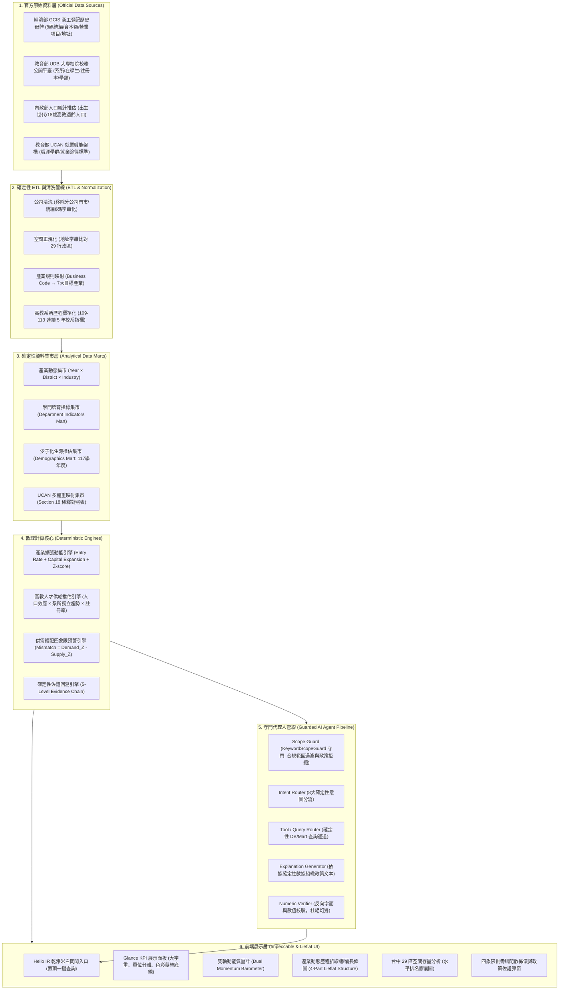
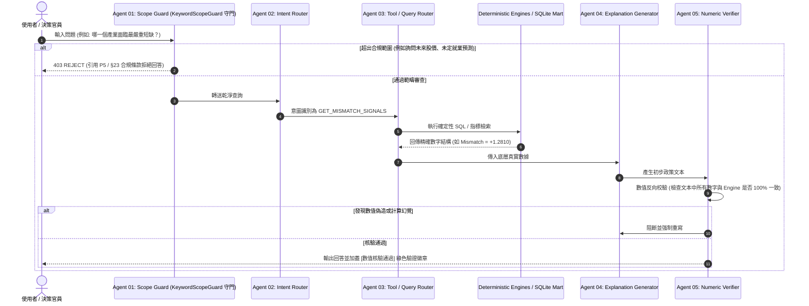

> 治理更新（2026-10-05）：現行範圍檢查是 `agent/keyword_scope_guard.py` 的本地規則，非 AI 模型；欄位、拒答與稽核行為以 [GOVERNANCE.md](GOVERNANCE.md) 為準。下列舊管線、HTTP 403 與時序圖屬原始設計，非現行 API 契約。

# 區域產業 × 高教人才供需錯配預警系統 (System Specification v1.0)

> **目標賽事**：全國大專校院資訊應用服務創新競賽 (InnoServe Awards) —— 經濟部商工登記資料應用組 (GCIS-OD Track)  
> **系統版本**：v1.0 MVP Production Ready  
> **系統定位**：Regional Industry–Talent Structural Mismatch Early-Warning System (區域產業 × 高教人才結構性錯配預警系統)  
> **核心受眾**：地方政府經發局/教育局決策幕僚、大專校院校務研究中心 (IR Office)、產學合作處、學生交接團隊  

---

## 一、系統願景與設計哲學

### 1.1 核心痛點與系統目標
傳統高教與產業人才政策常面臨三大核心結構性盲點：
1. **就業端與教育端資料脫鉤**：企業動能統計（商工登記、資本變更）與大專校院培育數據（校務公開平台 UDB、系所註冊率）長期由不同部會管轄，缺乏標準化本體映射。
2. **少子化海嘯的不可逆衝擊**：民國 117 學年度大專新生將迎來「虎年出生世代」大谷底（全國生源估計自 113 學年之 18.8 萬人驟降至 15.6 萬人，跌幅達 -17.02%），若不提前 4 年推估，產業將面臨斷崖式技術缺工。
3. **LLM 生成式 AI 的數值幻覺與黑箱運算**：多數 AI 應用直接讓大型語言模型「推算缺工人數」或「自行分類產業」，產生無法驗證的虛假數字與因果謬誤。

**本系統的核心目標**：  
整合**經濟部商工登記歷程母體**、**教育部大專校院校務資訊公開平台 (UDB)**、**內政部出生與人口推估**及 **教育部 UCAN 職涯架構**，建立一套具備**全流程可回溯性 (End-to-End Traceability)** 與 **100% 確定性 (Deterministic First)** 的區域產業動能與高教供給預警決策雷達。

本系統聚焦回答四大政策核心提問：
1. **台中市哪些產業正在顯著擴張或動能收縮？**
2. **台中 29 行政區的特定產業活動聚集在哪些空間聚落？**
3. **面對 117 年少子化虎年谷底，對應各產業之高教人才供給池如何異質性衰退？**
4. **哪些產業呈現「產業擴張動能高」但「高教供給緊縮」的結構性短缺預警？**

---

### 1.2 系統五大設計原則 (Five System Principles)

```
┌─────────────────────────────────────────────────────────────┐
│                    FIVE SYSTEM PRINCIPLES                   │
├─────────────────────────────────────────────────────────────┤
│ P1. Deterministic First (確定性優先，數字全由程式精算)     │
│ P2. LLM Does Not Calculate (LLM 絕對不計算任何數值)         │
│ P3. LLM Does Not Classify (產業與學門映射一律依固定規則表)  │
│ P4. Traceable (所有輸出具備 5 級確定性佐證回溯鏈)          │
│ P5. Warning, Not Prediction (定位為結構性預警，非就業預測)  │
└─────────────────────────────────────────────────────────────┘
```

- **P1. Deterministic First（確定性第一）**：  
  所有指標（新設率、增資擴張率、動能 Z 分數、生源精算推估、錯配向量強度）一律由 Python 數理引擎與 SQLite 確定性產出，拒絕任何非確定性黑箱計算。
- **P2. LLM Does Not Calculate（LLM 不計算）**：  
  大型語言模型嚴格禁止參與任何四則運算、比例折算或統計回歸。LLM 僅能閱讀由確定性引擎輸出的結構化結果並組織成流暢的政策解說文本。
- **P3. LLM Does Not Classify（LLM 不分類）**：  
  經濟部營業項目代碼（Business Code）至 7 大目標產業的映射、教育部系所學類至 UCAN 職涯途徑的關聯，均由靜態版本化規則表（Mapping Tables）嚴格定義，杜絕 LLM 即時判斷引發的分類飄移。
- **P4. Traceable（全流程確定性溯源）**：  
  系統提供五級回溯鏈：
  $$\text{政策警示訊號 (Result)} \rightarrow \text{指標數值 (Indicator)} \rightarrow \text{數理公式 (Calculation)} \rightarrow \text{集市寬表 (Processed Table)} \rightarrow \text{部會原始資料 (Source Data)}$$
- **P5. Warning, Not Prediction（結構性警示，非就業預測）**：  
  本系統產出之 `Mismatch Signal` 嚴格定義為「高教培育池與企業設立/增資動能之相對張力警示」，嚴禁宣稱為「未來缺工人數預測」或「就業需求保證」，符合公部門統計發布之合規底線。

---

## 二、系統全景架構 (Overall Architecture)



---

## 三、官方資料來源與清洗規範

### 3.1 經濟部 GCIS 商工登記母體 (DS01)
- **資料範圍**：登記地址屬於「臺中市」之公司與商業登記歷程。
- **欄位規範**：
  - `company_id`：統一編號（統一為 8 位純數字字串，不足者補 0 或除錯）。
  - `company_name`：公司名稱（依規則過濾或註記「分公司」、「辦事處」、「辦理處」、「門市」等非獨立法人實體）。
  - `registration_date`：設立核准日期（民國/西元轉標準 YYYY-MM-DD）。
  - `status`：營業狀況（核准設立、解散、廢止、停業）。
  - `capital`：資本額（新台幣元，整數化）。
  - `address`：登記地址。
  - `business_item_code`：營業項目代碼（如 `CA02010`, `I301010`）。
  - `change_date`：最後異動日期（判斷增資與解散年度）。
- **行政區萃取規則 (Section 7.3)**：
  - 比對地址前綴：`臺中市{行政區}區...` 或 `台中市{行政區}...`
  - 成功映射至台中市 29 個合法法定行政區；若無法比對，標記為 `UNKNOWN` 並記錄於錯誤稽核報告。

### 3.2 教育部校務資訊公開平臺 UDB (DS02)
- **資料範圍**：臺中市轄區內 14 所大專校院（國立中興大學、國立臺中科技大學、國立臺中教育大學、國立勤益科技大學、逢甲大學、東海大學、靜宜大學、亞洲大學、朝陽科技大學、弘光科技大學、嶺東科技大學、中臺科技大學、修平科技大學、國立臺灣體育運動大學）。
- **歷程年限**：109、110、111、112、113 學年度（連續 5 年）。
- **指標維度**：系所代碼、系所名稱、學類代碼、在學學生總數、一年級新生註冊率、核定招生名額。

### 3.3 內政部人口統計與少子化推估 (DS03)
- **少子化關鍵年標**：
  - 113 學年度（基期）：適齡入學人口（民國 95 年次生源）約 188,000 人。
  - 117 學年度（推估年）：適齡入學人口（民國 99 年次虎年出生世代）大谷底，全國生源僅剩 156,000 人（淨減少 32,000 人，生源海嘯跌幅達 -17.02%）。

---

## 四、七大目標產業分類與 UCAN 稀釋架構

### 4.1 七大目標產業定義 (Target Industries)
本系統依據台中區域經濟發展優勢（精密機械軸帶、中科半導體、軟體園區、台中港物流與數位健康聚落），鎖定 7 大代表性產業：

| 產業代碼 (`industry_id`) | 產業名稱 | 核心業務與代表營業代碼 | 代表色 |
| :--- | :--- | :--- | :--- |
| **`IND_MFG`** | **智慧製造與精密機械** | 數控工具機、機器人、精密組件製造 (`CA02010`, `CB01010`) | 科技藍 (`#2563EB`) |
| **`IND_ICT`** | **資訊軟體與數位科技** | 軟體出版、雲端運算、人工智慧開發 (`I301010`, `I301020`, `IZ13010`) | 紫羅蘭 (`#8B5CF6`) |
| **`IND_SEM`** | **半導體與綠能科技** | 晶圓製造組裝、封測、光電與綠能工程 (`CC01110`, `E601010`) | 翡翠綠 (`#059669`) |
| **`IND_BIOMED`** | **生技醫療與精準健康** | 醫療器材、智慧輔具、製藥研發 (`CF01010`, `C802040`) | 緋紅粉 (`#EC4899`) |
| **`IND_PRO_FIN`** | **專業商管與金融服務** | 會計審計、企業管理顧問、金融保險 (`I102010`, `H701010`) | 琥珀橙 (`#D97706`) |
| **`IND_TRADE_LOG`** | **國際貿易與現代物流** | 跨境貿易、台中港海運承攬、冷鏈倉儲 (`F401010`, `G801010`) | 水鴨青 (`#06B6D4`) |
| **`IND_TOUR_CULT`** | **數位文創與觀光休閒** | 多媒體娛樂、IP 授權、會展觀光服務 (`J503010`, `J701010`) | 珊瑚橘 (`#F97316`) |

### 4.2 UCAN 職涯學門映射與多權重稀釋 (Section 15, 16, 18)
避免單一系所（如企管系、資管系）全數重複計算至不同產業，系統引入 **Section 18 General Department Dilution 稀釋機制**：
- **Primary Mapping（核心對應）**：權重 $W_{primary} = 1.0$（如資工系 $\rightarrow$ 資訊軟體業）。
- **Secondary Mapping（跨域次要對應）**：權重 $W_{secondary} = 0.5$（如企業管理系 $\rightarrow$ 專業商管 1.0、國際貿易 0.5、資訊軟體 0.5）。
- **標準化歸一化約束**：
  $$\sum_{i} W(d, i) \le 2.0$$
  保證廣泛系所不會在人才供給池產生浮濫虛報。

---

## 五、確定性數理引擎與指標計算邏輯

### 5.1 產業需求擴張動能引擎 (Industry Momentum Engine)
針對各目標產業 $i$ 與年度 $t$（基期為 113 年度，計算 109-113 連續 5 年歷程）：

1. **新設動能訊號 (Entry Signal)**：
   $$\text{EntryRate}(i, t) = \frac{\text{NewCompanies}(i, t)}{\text{BeginningStock}(i, t)}$$
   $$\text{EntryTrend}(i) = \text{Slope}\Big(\big[\text{EntryRate}(i, t)\big]_{t=109}^{113}\Big)$$

2. **資本擴張動能訊號 (Capital Signal)**：
   $$\text{CapitalExpansionRate}(i, t) = \frac{\text{CapitalIncreaseCompanies}(i, t)}{\text{BeginningStock}(i, t)}$$
   $$\text{CapitalTrend}(i) = \text{Slope}\Big(\big[\text{CapitalExpansionRate}(i, t)\big]_{t=109}^{113}\Big)$$

3. **解散退場訊號 (Exit Signal - 風險參考)**：
   $$\text{ExitRate}(i, t) = \frac{\text{DissolvedCompanies}(i, t)}{\text{BeginningStock}(i, t)}$$
   > *註：依據規格原則，退場指標因實務申報時間遞延，僅作為輔助佐證風險參考，不計入主要擴張分數。*

4. **產業需求擴張動能主分數 (Demand Momentum Z-score)**：
   對 7 大產業進行 Z-score 標準化（均值 $\mu=0$、標準差 $\sigma=1$）：
   $$Z_{entry}(i) = \frac{\text{EntryRate}(i) - \mu_{entry}}{\sigma_{entry}}$$
   $$Z_{capital}(i) = \frac{\text{CapitalRate}(i) - \mu_{capital}}{\sigma_{capital}}$$
   $$\text{DemandMomentum}(i) = 0.5 \times Z_{entry}(i) + 0.5 \times Z_{capital}(i)$$

---

### 5.2 高教人才供給推估引擎 (Talent Supply Projection Engine)
針對系所 $d$ 與目標產業 $i$，推估至 117 學年度之培育人才供給量：

1. **系所獨立市占率趨勢 (Department Share Trend)**：
   $$\text{DeptShare}(d, t) = \frac{\text{Students}(d, t)}{\text{TotalTaichungStudents}(t)}$$
   使用 109–113 歷年數據進行線性最小平方法外推，得到 $\text{ProjectedShare}(d, 117)$。禁止全系所等比例衰退假設。

2. **系所新生註冊率趨勢 (Registration Rate Trend)**：
   外推得 $\text{ProjectedRegRate}(d, 117)$，建立系所間的競爭力異質性。

3. **單一系所 117 學年推估生源量**：
   $$\text{ProjectedStudents}(d, 117) = \text{NationalAge18Pop}(117) \times \text{ProjectedShare}(d, 117) \times \text{ProjectedRegRate}(d, 117)$$

4. **產業高教人才供給池與供給動能分數**：
   $$\text{IndustrySupply}(i, 117) = \sum_{d} \Big( \text{ProjectedStudents}(d, 117) \times W(d, i) \Big)$$
   $$\text{SupplyGrowthRate}(i) = \frac{\text{IndustrySupply}(i, 117) - \text{IndustrySupply}(i, 113)}{\text{IndustrySupply}(i, 113)}$$
   $$\text{SupplyMomentum}(i) = Z_{\text{growth}}(i) = \frac{\text{SupplyGrowthRate}(i) - \mu_{\text{growth}}}{\sigma_{\text{growth}}}$$

---

### 5.3 供需錯配四象限預警引擎 (Mismatch Early-Warning Engine)

1. **錯配向量強度 (Mismatch Intensity)**：
   $$\text{Mismatch}(i) = \text{DemandMomentum}(i) - \text{SupplyMomentum}(i)$$

2. **四象限分類矩陣**：
   ```
                                 產業需求擴張動能 (Z_demand)
                                             ▲
                                             │
             第二象限: 嚴重短缺風險          │         第一象限: 雙重擴張
     (High Demand × Low Supply, 短缺警示)    │  (High Demand × High Supply, 產學俱熱)
                                             │
   ──────────────────────────────────────────┼──────────────────────────────────────────►
                                             │                               高教人才供給動能
             第三象限: 雙重收縮              │         第四象限: 相對過剩壓力   (Z_supply)
      (Low Demand × Low Supply, 產業轉型)    │  (Low Demand × High Supply, 過剩警示)
                                             │
                                             ▼
   ```

3. **預警等級評定**：
   - **High Warning（高度預警 - 嚴重短缺）**：落在第二象限，且 $\text{Mismatch}(i) > +0.5$（如資訊軟體、文創娛樂）。
   - **High Warning（高度預警 - 相對過剩）**：落在第四象限，且 $\text{Mismatch}(i) < -0.5$（如傳統精密機械在大專端的過度集中但產業新設放緩）。
   - **Medium / Low Warning**：落在第一、三象限。

---

## 六、守門型 AI 決策代理人 (Guarded AI Agent Pipeline)

本系統設計專屬之 **Agent 01–05 五道確定性護欄管線**：



---

## 七、前端視覺系統規範 (Impeccable × Lieflat Charts)

本系統嚴格遵循 `pbakaus/impeccable` 規範與 `larashero3-dotcom/lieflat-charts` 設計哲學：
1. **紙質米白淺色系（Warm Paper Ivory）**：
   - 背景主色：`#FAF8F5`
   - 卡片表面：純白 `#FFFFFF` 搭配 `1px border-stone-200` 與 `shadow-2xs`
   - 文字主墨色：Stone 900 `#1C1917`，次要文字：Stone 500 `#78716C`
2. **圖表四段式規範（Lieflat Charts 4-Part Structure）**：
   - 結論主標 + 中圓點副標 + 極淡髮絲格線（`rgba(28,25,23,0.06)`）+ 底部 `SOURCE/FORMULA` 溯源。
3. **表格排版（Lupi Editorial Table）**：
   - 米底表頭 `#FBF9F6`、等寬數字 `IBM Plex Mono`、顯式正負標註、輕量彩點膠囊狀態標籤。
4. **數字風格（Glance / Lupi Numbers）**：
   - 巨幅展示數字 `text-3xl` / `text-4xl`、獨立分離單位 `text-xs font-semibold text-stone-500`、底部彩色細髮絲強調線。
5. **代碼品質要求**：
   - 執行 `./.agents/skills/impeccable/scripts/impeccable detect` 保持 **0 anti-patterns, 0 warnings**。
   - 字級階梯嚴格遵循 $\ge 1.25\times$ 等比階梯（38px / 29px / 23px / 18px / 14px / 12px）。
